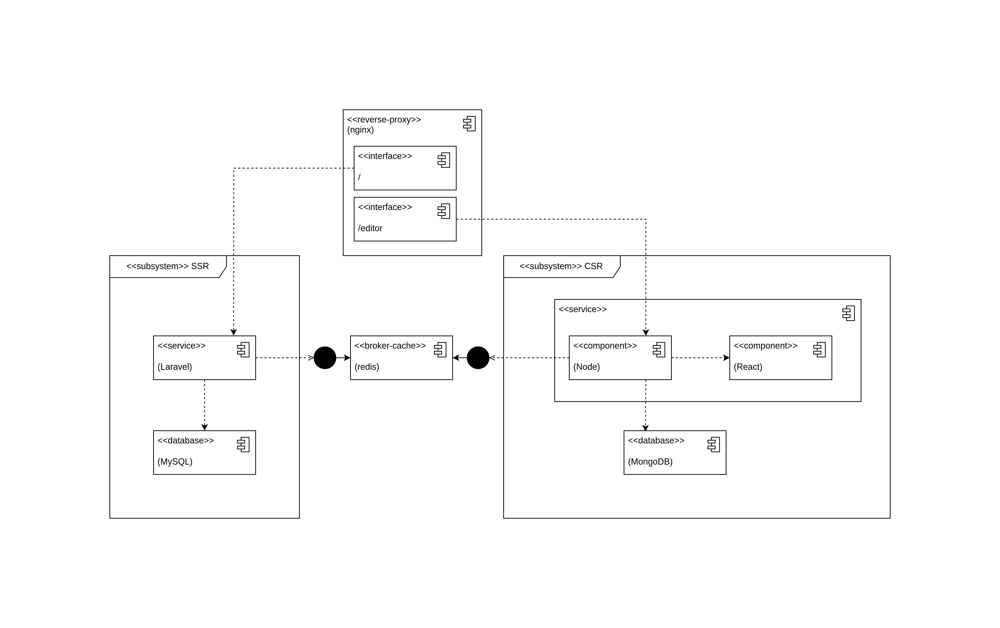

# Blogs Prototype Documentation

> You can visit the application using this link [https://blogs-prototype.mohamedaymn.site](https://blogs-prototype.mohamedaymn.site)

## What Is Blogs Prototype?
[Blogs Prototype](https://blogs-prototype.mohamedaymn.site) is a model for Blogs creation and display website with fantsey editor and users reader experience and interaction.

## What Problem Does It Solve?
Balance between client side and server side computations to provide on-click time update for better user experience, without over reliance of either comput power of client or server, and also without losing the advantage of SEO (search engine optimization).

## Why Is It Built?

It is a task and show case in a recruitment process of a software company.

## Architecture & Tech Stack

## Additional Information
- You can visit the API documenation [using this link](https://blogs-prototype.mohamedaymn.site/api/docs).

